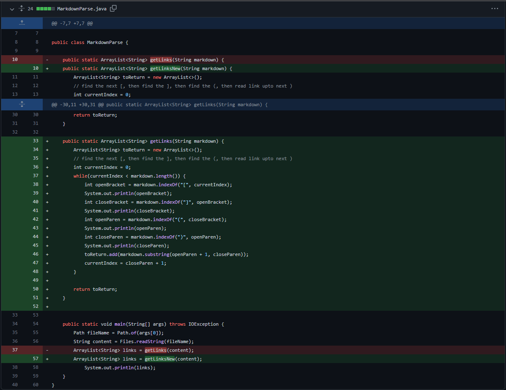
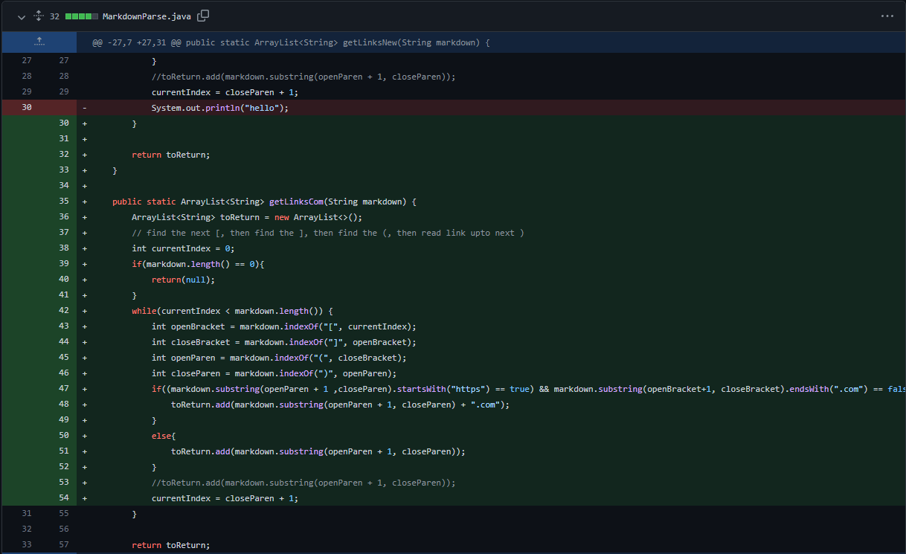

# **Code Change #1**
**Code Changes From Github:**

---
**Link To Test File For Failure Inducing Input:**
[example.md test file](https://github.com/Georgexli3/markdown-parser/blob/main/example.md?plain=1)
---
**Failure Inducing Output:**

---
**Relationship:**
---
The reason why there was a failure-inducing input was because of the "example.md" test file having an incorrect syntax. The bug in my code, which was the fact that there was nothing to check for incorrect syntax, caused a symptom that output the incorrect link without a .html at the end. This caused a print to be to "google" rather than "google.html".

# **Code Change #2**
**Code Changes From Github:**

---
**Link To Test File For Failure Inducing Input:**
[fail1.md test file](https://github.com/Georgexli3/markdown-parser/blob/main/fail1.md)
---
**Failure Inducing Output:**

---
**Relationship:**
---
The reason why there was a failure-inducing input was because of the "fail1.md" test file having no input. The bug in my code, which was the fact that it did not account for a test file being empty, caused a symptom that output the an empty arraylist. This caused a print to [] instead of something like an error message or a null return.

# **Code Change #3**
**Code Changes From Github:**

---
**Link To Test File For Failure Inducing Input:**
[fail2.md test file](https://github.com/Georgexli3/markdown-parser/blob/main/fail2.md)
---
**Failure Inducing Output:**

---
**Relationship:**
---
The reason why there was a failure-inducing input was because of the "fail2.md" test file having no ".com" at the end of one of the links. The bug in my code, which was the fact that it did not account for a link not having ".com" at the end, caused a symptom that output an "https" link without the .com at the end of it. This caused a print to [https://google, google.html] instead of [https://google.com, google.html].